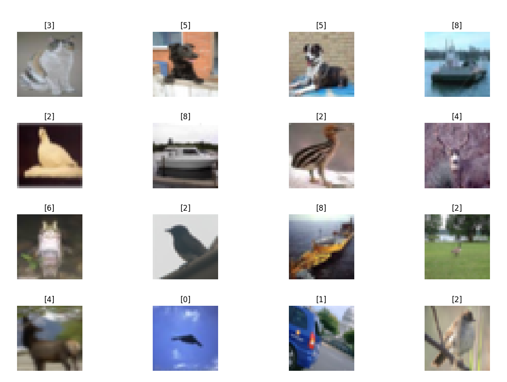
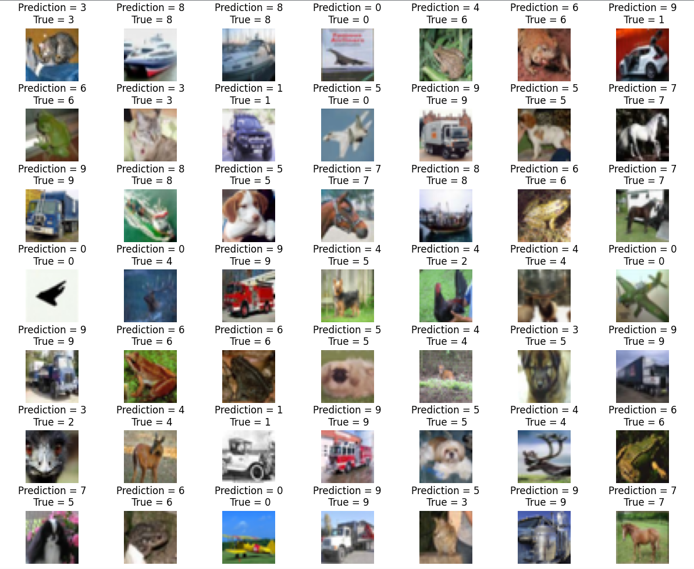
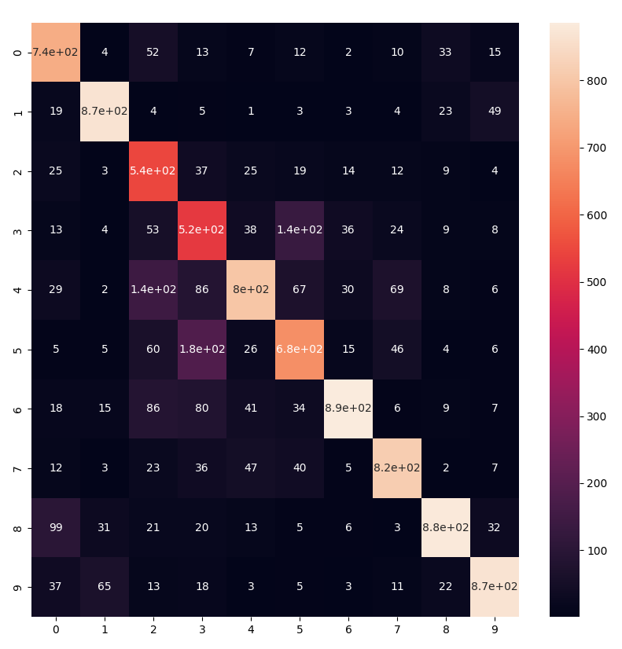

## Tensorflow Image Classifier

### CIFAR-10

The [CIFAR-10](https://www.cs.toronto.edu/~kriz/cifar.html) dataset consists of 60000 32x32 colour images in 10 classes, with 6000 images per class. There are 50000 training images and 10000 test images:





The dataset is divided into five training batches and one test batch, each with 10000 images. The test batch contains exactly 1000 randomly-selected images from each class. The training batches contain the remaining images in random order, but some training batches may contain more images from one class than another. Between them, the training batches contain exactly 5000 images from each class. You can download the [Keras dataset](https://github.com/keras-team/keras/tree/master/keras/datasets) by:


```bash
from tensorflow.keras import datasets
(train_images, train_labels), (test_images, test_labels) = datasets.cifar10.load_data()
```

## Run

```bash
python main.py
...
Epoch 100/100
98/98 [==============================] - 4s 41ms/step - loss: 0.5412 - accuracy: 0.8101
313/313 [==============================] - 1s 2ms/step - loss: 0.7025 - accuracy: 0.7602
Test Accuracy: 0.760200023651123
```

### Validation




